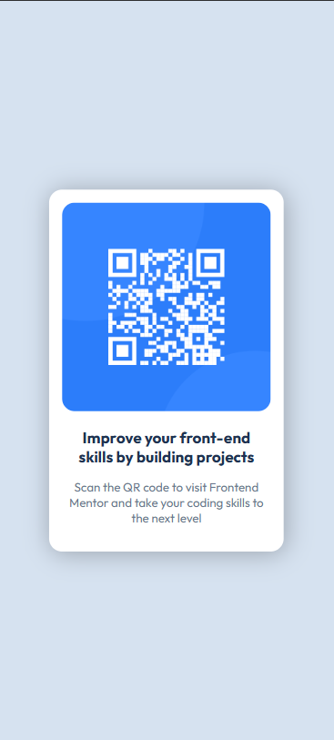

# QR Code Component - Frontend Mentor Challenge

[English](#english) • [Español](#español)

# English Version <a id="english"></a>

# Frontend Mentor - QR Code Component Solution

This is my solution to the [QR Code Component challenge](https://www.frontendmentor.io/challenges/qr-code-component-iux_sIO_H) from Frontend Mentor.  
This project helped me practice basic layout structure, styling, and component organization using HTML and CSS.

## Table of Contents

- [QR Code Component - Frontend Mentor Challenge](#qr-code-component---frontend-mentor-challenge)
- [English Version ](#english-version-)
- [Frontend Mentor - QR Code Component Solution](#frontend-mentor---qr-code-component-solution)
  - [Table of Contents](#table-of-contents)
  - [Overview](#overview)
    - [Screenshot](#screenshot)
    - [Desktop version](#desktop-version)
    - [Mobile version](#mobile-version)
    - [Links](#links)
  - [My Process](#my-process)
    - [Built With](#built-with)
    - [What I Learned](#what-i-learned)
  - [Continued Development](#continued-development)
- [Frontend Mentor - Solución al componente de código QR](#frontend-mentor---solución-al-componente-de-código-qr)
  - [Tabla de contenidos](#tabla-de-contenidos)
  - [Descripción general](#descripción-general)
    - [Captura de pantalla](#captura-de-pantalla)
    - [Versión escritorio](#versión-escritorio)
    - [Versión móvil](#versión-móvil)
    - [Links](#links-1)
  - [Mi proceso](#mi-proceso)
    - [Construido con](#construido-con)
    - [Lo que aprendí](#lo-que-aprendí)
    - [Desarrollo continuo](#desarrollo-continuo)
  - [Autor](#autor)

---

## Overview

This is a simple and beginner-friendly project to practice semantic HTML, CSS fundamentals, variables, typography, and clean card-based design.

The objective is to recreate the original design provided by Frontend Mentor as closely as possible.

### Screenshot

Here are the **final screenshots of my solution**, both desktop and mobile:

### Desktop version


### Mobile version


### Links

- **Frontend Mentor solution URL:** 
  https://www.frontendmentor.io/solutions/qr-code-component-using-flexbox-_egax3nRUE
- **Live Site (GitHub Pages):**  
  https://natdevx.github.io/frontend-mentor-solutions/01-qr-code/

---

## My Process

### Built With

- Semantic HTML5  
- CSS custom properties (variables)  
- Mobile-first workflow  
- Flexbox  
- Google Fonts (Outfit)

### What I Learned

In this challenge I practiced:

- Centering a container on the screen using margins and flexbox  
- Using CSS variables for colors and spacing  
- Applying shadows, rounded borders, and padding  
- Building a simple component with clean HTML + CSS  
- Naming classes in a clear and maintainable way  

Example of one of my styles:

```css
.card {
  max-width: 290px;
  background-color: var(--White);
  padding: 1rem;
  border-radius: 1rem;
  box-shadow: 2px 2px 30px rgba(0, 0, 0, 0.269);
}
```

## Continued Development

For future challenges, I want to improve:
- More advanced responsive design.
- Accessibility best practices (a11y).
- More scalable components.
- Better CSS structure and organization.

Author

GitHub: https://github.com/natdevx

Frontend Mentor: https://www.frontendmentor.io/profile/natdevx

---
---

# Frontend Mentor - Solución al componente de código QR

Esta es mi solución al desafío [QR code component](https://www.frontendmentor.io/challenges/qr-code-component-iux_sIO_H) de Frontend Mentor.  
Este proyecto me ayudó a practicar conceptos básicos de maquetación, estilos y organización de un componente usando HTML y CSS.

## Tabla de contenidos

- [QR Code Component - Frontend Mentor Challenge](#qr-code-component---frontend-mentor-challenge)
- [English Version ](#english-version-)
- [Frontend Mentor - QR Code Component Solution](#frontend-mentor---qr-code-component-solution)
  - [Table of Contents](#table-of-contents)
  - [Overview](#overview)
    - [Screenshot](#screenshot)
    - [Desktop version](#desktop-version)
    - [Mobile version](#mobile-version)
    - [Links](#links)
  - [My Process](#my-process)
    - [Built With](#built-with)
    - [What I Learned](#what-i-learned)
  - [Continued Development](#continued-development)
- [Frontend Mentor - Solución al componente de código QR](#frontend-mentor---solución-al-componente-de-código-qr)
  - [Tabla de contenidos](#tabla-de-contenidos)
  - [Descripción general](#descripción-general)
    - [Captura de pantalla](#captura-de-pantalla)
    - [Versión escritorio](#versión-escritorio)
    - [Versión móvil](#versión-móvil)
    - [Links](#links-1)
  - [Mi proceso](#mi-proceso)
    - [Construido con](#construido-con)
    - [Lo que aprendí](#lo-que-aprendí)
    - [Desarrollo continuo](#desarrollo-continuo)
  - [Autor](#autor)

---

## Descripción general
Este es un proyecto sencillo y perfecto para practicar los fundamentos de HTML semántico, CSS, variables, tipografías y un diseño limpio centrado en una tarjeta.

El objetivo es replicar lo más fielmente posible el diseño original proporcionado por Frontend Mentor.

### Captura de pantalla
Estas son las **capturas finales de mi solución**, tanto en escritorio como en móvil:

### Versión escritorio


### Versión móvil


### Links

- URL de la solución en Frontend Mentor: https://www.frontendmentor.io/solutions/qr-code-component-using-flexbox-_egax3nRUE
- URL del sitio en vivo (GitHub Pages): https://natdevx.github.io/frontend-mentor-solutions/01-qr-code/ 

---

## Mi proceso

### Construido con

- HTML5 semántico  
- Propiedades personalizadas de CSS (variables)  
- Mobile-first  
- Flexbox  
- Google Fonts (Outfit)

### Lo que aprendí

En este proyecto practiqué:

- Cómo centrar un contenedor en pantalla usando márgenes y flexbox.
- Usar variables CSS para colores y tamaños
- Dar estilos con sombras, bordes redondeados y espaciados
- Estructurar un componente simple con HTML + CSS
- Organización de clases con nombres claros y mantenibles.

Ejemplo de uno de mis estilos:

```css
.card {
  max-width: 290px;
  background-color: var(--White);
  padding: 1rem;
  border-radius: 1rem;
  box-shadow: 2px 2px 30px rgba(0, 0, 0, 0.269);
}
```

### Desarrollo continuo
En futuros proyectos quiero mejorar:
- Responsive design avanzado
- Buenas prácticas en accesibilidad (a11y)
- Componentes más escalables
- Mejor organización y estructura del CSS

## Autor

- GitHub: https://github.com/natdevx
- Frontend Mentor: https://www.frontendmentor.io/profile/natdevx