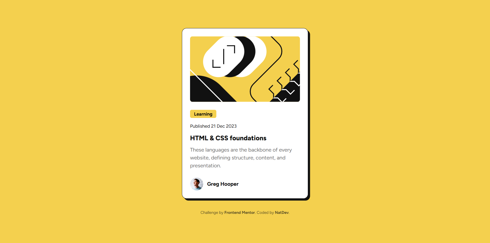
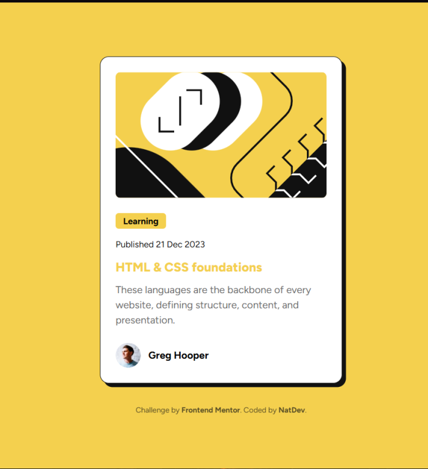
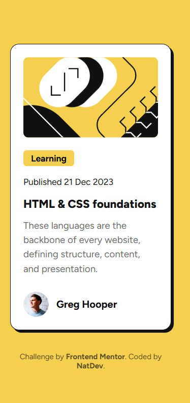

# Blog Preview Card — Frontend Mentor Challenge  
[English](#english) • [Español](#español)

---

# English Version <a id="english"></a>

## Frontend Mentor – Blog Preview Card Solution

This is my solution to the  
**Blog preview card** challenge from Frontend Mentor.

This project helped me practice layout structure, typography, small interactions, and responsive design using only **HTML and CSS**.

---

## Table of Contents

- [Blog Preview Card — Frontend Mentor Challenge](#blog-preview-card--frontend-mentor-challenge)
- [English Version ](#english-version-)
  - [Frontend Mentor – Blog Preview Card Solution](#frontend-mentor--blog-preview-card-solution)
  - [Table of Contents](#table-of-contents)
  - [Overview ](#overview-)
  - [Screenshot ](#screenshot-)
    - [Desktop version](#desktop-version)
    - [Active states version](#active-states-version)
    - [Mobile version](#mobile-version)
  - [Links ](#links-)
  - [My Process ](#my-process-)
  - [Built With ](#built-with-)
  - [What I Learned ](#what-i-learned-)
    - [Example: Importing the font](#example-importing-the-font)
    - [Example: Card structure](#example-card-structure)
  - [Continued Development ](#continued-development-)
  - [Author ](#author-)
- [Versión en Español ](#versión-en-español-)
  - [Frontend Mentor – Solución al Blog Preview Card](#frontend-mentor--solución-al-blog-preview-card)
  - [Descripción General ](#descripción-general-)
  - [Capturas ](#capturas-)
    - [Versión escritorio](#versión-escritorio)
    - [Versión con estados activos](#versión-con-estados-activos)
    - [Versión móvil](#versión-móvil)
  - [Enlaces ](#enlaces-)
  - [Mi Proceso ](#mi-proceso-)
  - [Construido Con ](#construido-con-)
  - [Lo que Aprendí ](#lo-que-aprendí-)
    - [Ejemplo: Importando la fuente](#ejemplo-importando-la-fuente)
  - [Desarrollo Continuo ](#desarrollo-continuo-)
  - [Autor ](#autor-)

---

## Overview <a id="overview"></a>

The challenge consists of building a **blog preview card** containing:

- An image  
- A category tag  
- A publication date  
- A title  
- A description  
- Author information  

The goal is to recreate the provided design using **clean semantic HTML** and **modular CSS**.

The component is **fully responsive**, working smoothly on both desktop and mobile layouts.

---

## Screenshot <a id="screenshot"></a>

### Desktop version


### Active states version


### Mobile version


---

## Links <a id="links"></a>

- **Frontend Mentor submission:** (Add when uploaded)  
- **Live Site (GitHub Pages):**  
  https://natdevx.github.io/frontend-mentor-solutions/docs/02-blog-preview-card/

---

## My Process <a id="my-process"></a>

---

## Built With <a id="built-with"></a>

- Semantic HTML5 (`<main>`, `<article>`, `<footer>`, `<time>`)
- Pure CSS
- **Figtree** variable font
- Flexbox
- CSS custom properties (variables)
- Mobile-first workflow
- Hover interactions

---

## What I Learned <a id="what-i-learned"></a>

Some of the key takeaways from this challenge:

- Proper use of `<article>` for independent content blocks  
- Using `<time>` to mark publication dates  
- Importing and using variable fonts with `@font-face`  
- Creating stylized “cartoon border” shadows  
- Building clean and reusable card components  
- Responsive design using media queries  

### Example: Importing the font

```css
@font-face {
  font-family: "Figtree";
  src: url("./assets/fonts/Figtree-VariableFont_wght.ttf") format("truetype");
  font-weight: 100 900;
}
```
### Example: Card structure
```css
.card {
  background: var(--white);
  width: 384px;
  padding: 24px;
  border-radius: 14px;
  border: 1px solid var(--gray-950);
  box-shadow: 6px 6px 0 var(--gray-950);
}
```

## Continued Development <a id="continued-development"></a>

In future challenges, I want to improve:
- More scalable CSS architecture (e.g., BEM).
- Smoother UI animations.
- Accessibility best practices (a11y).
- Separation and modularization of CSS

## Author <a id="author"></a>

GitHub: https://github.com/natdevx

Frontend Mentor: https://www.frontendmentor.io/profile/natdevx

---
---
# Versión en Español <a id="español"></a>

## Frontend Mentor – Solución al Blog Preview Card

Esta es mi solución al desafío  
**Blog preview card** de Frontend Mentor.

Este proyecto me ayudó a practicar estructura de maquetación, tipografía, pequeñas interacciones y diseño responsivo usando únicamente **HTML y CSS**.

---
## Descripción General <a id="descripción-general"></a>

El desafío consiste en construir una **tarjeta de vista previa de un blog**, que incluye:

- Una imagen  
- Una etiqueta de categoría  
- Una fecha de publicación  
- Un título  
- Una descripción  
- Información del autor  

El objetivo es replicar el diseño original utilizando **HTML semántico limpio** y **CSS modular**.

El componente es **totalmente responsivo**, funcionando correctamente tanto en escritorio como en dispositivos móviles.

---

## Capturas <a id="capturas"></a>

### Versión escritorio


### Versión con estados activos


### Versión móvil


---

## Enlaces <a id="enlaces"></a>

- **Solución en Frontend Mentor:** (Añadir cuando se publique)  
- **Sitio en vivo (GitHub Pages):**  
  https://natdevx.github.io/frontend-mentor-solutions/docs/02-blog-preview-card/

---

## Mi Proceso <a id="mi-proceso"></a>

---

## Construido Con <a id="construido-con"></a>

- HTML5 semántico (`<main>`, `<article>`, `<footer>`, `<time>`)
- CSS puro
- Fuente variable **Figtree**
- Flexbox
- Propiedades personalizadas de CSS (variables)
- Flujo de trabajo mobile-first
- Interacciones hover

---

## Lo que Aprendí <a id="lo-que-aprendí"></a>

Algunos puntos importantes que reforcé durante este desafío:

- Uso correcto de `<article>` para contenido independiente  
- Uso de `<time>` para marcar fechas de publicación  
- Importación y uso de fuentes variables mediante `@font-face`  
- Creación de sombras estilo “cartoon border”  
- Construcción de componentes limpios y reutilizables  
- Diseño responsive con media queries  

### Ejemplo: Importando la fuente

```css
@font-face {
  font-family: "Figtree";
  src: url("./assets/fonts/Figtree-VariableFont_wght.ttf") format("truetype");
  font-weight: 100 900;
}
```

## Desarrollo Continuo <a id="desarrollo-continuo"></a>

En futuros desafíos, quiero mejorar:
- Arquitectura CSS más escalable (por ejemplo, BEM).
- Animaciones más fluidas.
- Mejores prácticas de accesibilidad (a11y).
- Separación y modularización del CSS

## Autor <a id="autor"></a>

GitHub: https://github.com/natdevx

Frontend Mentor: https://www.frontendmentor.io/profile/natdevx
