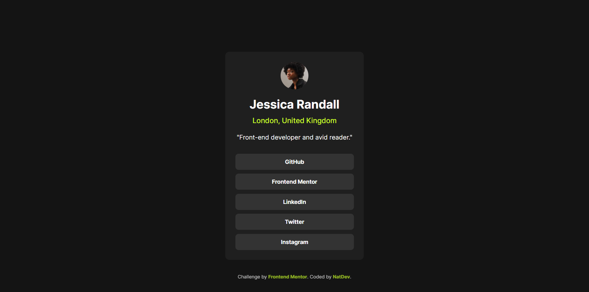
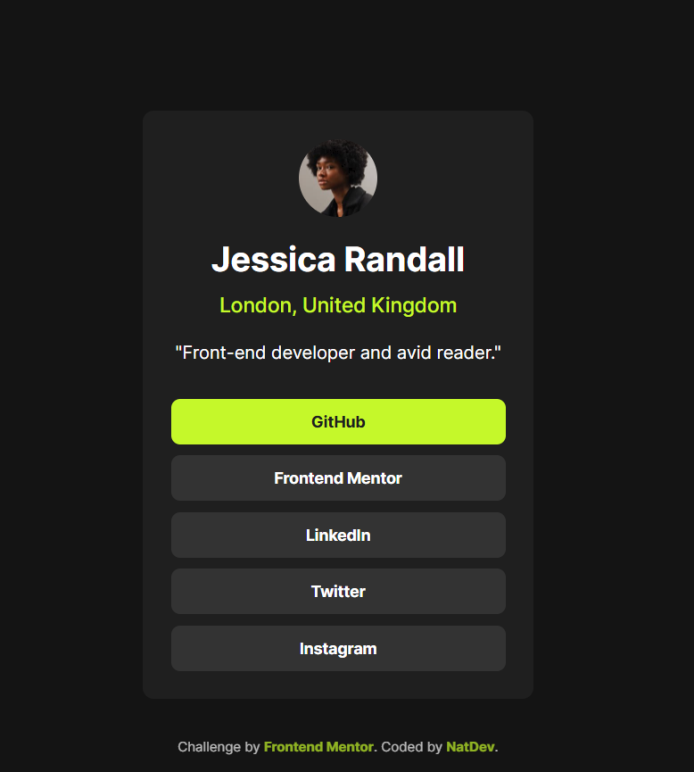
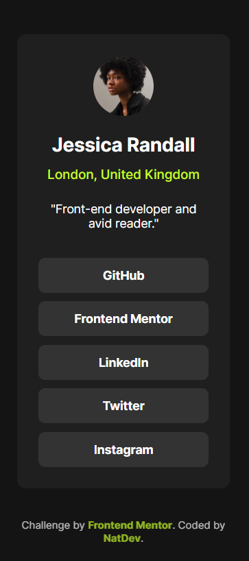

# Social Links Profile — Frontend Mentor Challenge  
[English](#english) | [Español](#español)

---

# English Version <a id="english"></a>

## Frontend Mentor – Social Links Profile Solution

This is my solution to the  
**Social links profile** challenge from Frontend Mentor.

This project helped me practice layout structure, typography, button styling, and responsive design using **HTML and CSS**.

---

## Table of Contents

- [Social Links Profile — Frontend Mentor Challenge](#social-links-profile--frontend-mentor-challenge)
- [English Version ](#english-version-)
  - [Frontend Mentor – Social Links Profile Solution](#frontend-mentor--social-links-profile-solution)
  - [Table of Contents](#table-of-contents)
  - [Overview ](#overview-)
  - [Screenshots ](#screenshots-)
    - [Desktop Version](#desktop-version)
    - [Hover States](#hover-states)
    - [Mobile Version](#mobile-version)
  - [Links ](#links-)
  - [Built With ](#built-with-)
  - [What I Learned ](#what-i-learned-)
    - [Example: Importing the font](#example-importing-the-font)
    - [Example: Button styling](#example-button-styling)
  - [Continued Development ](#continued-development-)
  - [Author ](#author-)

---

## Overview <a id="overview"></a>

This challenge consists of building a **social links profile card**, including:

- A profile photo  
- Name and location  
- A short bio  
- A list of social media buttons  

The goal is to recreate the provided design using **clean semantic HTML** and **modern CSS**.

The component is **fully responsive**, adjusting smoothly to different screen sizes.

---

## Screenshots <a id="screenshots"></a>

### Desktop Version


### Hover States


### Mobile Version


---

## Links <a id="links"></a>

- **Frontend Mentor Solution:** *(Add when uploaded)*  
- **Live Site (GitHub Pages):**  
  https://natdevx.github.io/frontend-mentor-solutions/docs/03-social-links-profile/

---

## Built With <a id="built-with"></a>

- Semantic HTML5  
- Pure CSS  
- **Inter** variable font  
- Flexbox  
- CSS custom properties  
- Mobile-first workflow  
- Hover effects  

---

## What I Learned <a id="what-i-learned"></a>

Some key takeaways from this challenge:

- How to structure a centered profile card  
- Using `@font-face` to load variable fonts in a local project  
- Creating reusable button styles  
- Improving hover animations  
- Designing clean UI with spacing and subtle contrast  

### Example: Importing the font

```css
@font-face {
  font-family: "Inter";
  src: url(assets/fonts/Inter-VariableFont_slnt,wght.ttf)
  format("truetype");
  font-weight: 400 700;
  font-style: normal;
  unicode-range: U+0000-00FF;
}
```
### Example: Button styling
```css
.card__button {
  background-color: var(--grey-700);
  color: var(--white);
  width: 100%;
  text-align: center;
  padding: 12px 0;
  border-radius: 8px;
  text-decoration: none;
  font-weight: 700;
  font-size: 14px;
}
.card__button:hover {
  background-color: var(--green);
  color: var(--grey-800);
  transition: all 0.3s ease;
}
```
## Continued Development <a id="continued-development"></a>

In future challenges, I want to keep improving:
- More polished animations and transitions. 
- Scalable CSS architecture.
- Designing more complex card layouts.
- Accessibility and keyboard navigation.

## Author <a id="author"></a>

GitHub: https://github.com/natdevx

Frontend Mentor: https://www.frontendmentor.io/profile/natdevx
