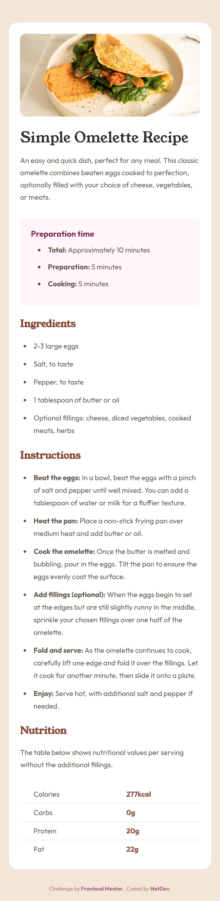

# Recipe Page — Frontend Mentor Challenge  
[English](#english) | [Español](#español)

---
# English Version <a id="english"></a>

## Frontend Mentor - Recipe page solution
This is my solution to the  
**Recipe page** challenge from Frontend Mentor.

This challenge focuses on building a clean and accessible recipe layout, including structured content, lists, and a nutrition table, using **semantic HTML** and **modern CSS**.

---

## Table of Contents

- [Recipe Page — Frontend Mentor Challenge](#recipe-page--frontend-mentor-challenge)
- [English Version ](#english-version-)
  - [Frontend Mentor - Recipe page solution](#frontend-mentor---recipe-page-solution)
  - [Table of Contents](#table-of-contents)
  - [Overview ](#overview-)
  - [Screenshots ](#screenshots-)
    - [Desktop Version](#desktop-version)
    - [Mobile Version](#mobile-version)
  - [Links ](#links-)
  - [Built With ](#built-with-)
  - [What I Learned ](#what-i-learned-)
    - [Example: Nutrition table styling ](#example-nutrition-table-styling-)
  - [Continued Development ](#continued-development-)
  - [Author ](#author-)

---

## Overview <a id="overview"></a>

The challenge consists of building a **recipe page layout**, which includes:

- A featured recipe image  
- Preparation time information  
- Ingredient list  
- Step-by-step instructions  
- A nutrition table  

The goal is to replicate the provided design as closely as possible while using **semantic HTML elements** and **clean, maintainable CSS**.

The layout is fully responsive and adapts smoothly to different screen sizes.

---

## Screenshots <a id="screenshots"></a>

### Desktop Version


### Mobile Version


---

## Links <a id="links"></a>

- **Frontend Mentor Solution:** *(Add when published)*  
- **Live Site (GitHub Pages):**  
  https://natdevx.github.io/frontend-mentor-solutions/docs/04-recipe-page/

---

## Built With <a id="built-with"></a>

- Semantic HTML5  
- Pure CSS  
- CSS custom properties  
- Flexbox  
- Mobile-first workflow  
- Responsive layout  
- Pseudo-classes and selectors  

---

## What I Learned <a id="what-i-learned"></a>

In this challenge, I practiced and reinforced:

- Structuring long-form content using semantic HTML  
- Styling lists and sections consistently  
- Building accessible tables for nutritional information  
- Controlling table borders using CSS selectors  
- Improving spacing and visual hierarchy  

### Example: Nutrition table styling <a id="example-nutrition-table-styling"></a>

One key detail in this challenge was removing the top border from the first table row while keeping separators between the rest:

```css
.nutrition-table tr:not(:first-child) th,
.nutrition-table tr:not(:first-child) td {
  border-top: 1px solid var(--stone-150);
}
```

## Continued Development <a id="continued-development"></a>
In future projects, I want to continue improving:
- CSS architecture and scalability.
- Accessibility best practices.
- More complex layouts.
- Pixel-perfect attention to design details

## Author <a id="author"></a>

GitHub: https://github.com/natdevx

Frontend Mentor: https://www.frontendmentor.io/profile/natdevx