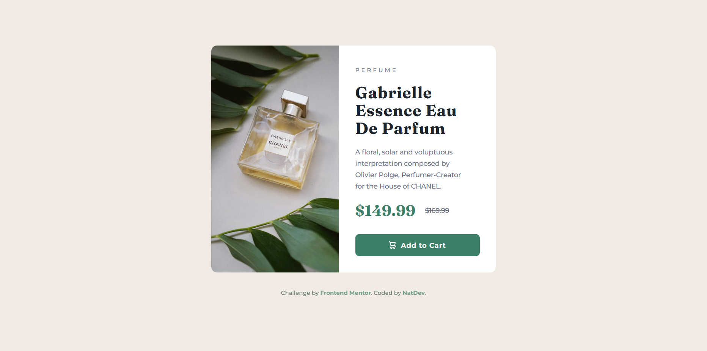
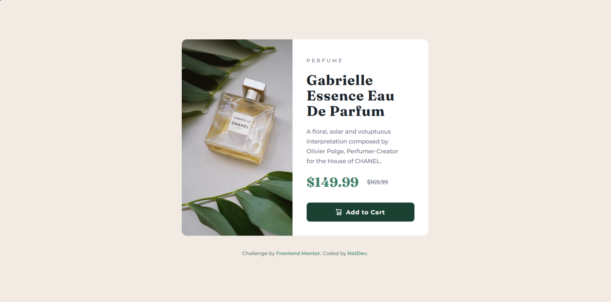
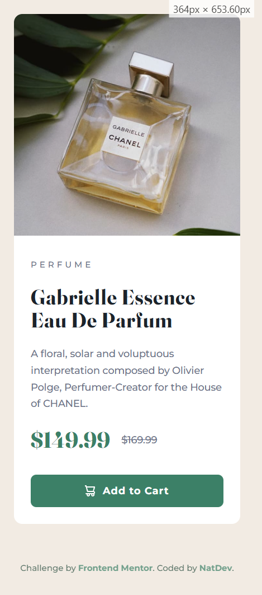

# Product Preview Card — Frontend Mentor Challenge  
[English](#english) | [Español](#español)

---

# English Version <a id="english"></a>

## Frontend Mentor - Product preview card component solution
This is my solution to the  
**Product preview card component** challenge from Frontend Mentor.

This challenge focuses on building a **responsive product card**, combining imagery, typography, pricing details, and a call-to-action button using **semantic HTML** and **modern CSS**.

---

## Table of Contents

- [Product Preview Card — Frontend Mentor Challenge](#product-preview-card--frontend-mentor-challenge)
- [English Version ](#english-version-)
  - [Frontend Mentor - Product preview card component solution](#frontend-mentor---product-preview-card-component-solution)
  - [Table of Contents](#table-of-contents)
  - [Overview ](#overview-)
  - [Screenshots ](#screenshots-)
    - [Desktop Version](#desktop-version)
  - [Mobile Version](#mobile-version)
  - [Links ](#links-)
  - [Built With ](#built-with-)
  - [What I Learned ](#what-i-learned-)
    - [Example: Responsive layout with Flexbox ](#example-responsive-layout-with-flexbox-)
  - [Continued Development ](#continued-development-)
  - [Autor ](#autor-)
- [Versión en Español ](#versión-en-español-)
  - [Frontend Mentor – Solución al Product Preview Card](#frontend-mentor--solución-al-product-preview-card)
  - [Tabla de Contenidos](#tabla-de-contenidos)
  - [Descripción General ](#descripción-general-)
  - [Capturas ](#capturas-)
    - [Versión Escritorio](#versión-escritorio)
    - [Versión Móvil](#versión-móvil)
  - [Enlaces ](#enlaces-)
  - [Construido Con ](#construido-con-)
  - [Lo que Aprendí ](#lo-que-aprendí-)
    - [Ejemplo: Layout responsivo con Flexbox ](#ejemplo-layout-responsivo-con-flexbox-)
  - [Desarrollo Continuo ](#desarrollo-continuo-)
  - [Autor ](#autor--1)

---

## Overview <a id="overview"></a>

The goal of this challenge was to recreate a **product preview card** as closely as possible to the provided design.

The component includes:
- A responsive product image (desktop and mobile)
- Product category label
- Product title and description
- Current and original price
- Add to cart button with icon

The layout adapts seamlessly between **desktop and mobile screen sizes**, ensuring clarity and usability across devices.

---

## Screenshots <a id="screenshots"></a>

### Desktop Version




## Mobile Version


---

## Links <a id="links"></a>

- **Frontend Mentor Solution:** *(Add when published)*  
- **Live Site (GitHub Pages):**  
  https://natdevx.github.io/frontend-mentor-solutions/docs/05-product-preview-card/

---

## Built With <a id="built-with"></a>

- Semantic HTML5  
- CSS custom properties  
- Flexbox  
- Responsive images (`<picture>`)  
- Desktop-first workflow  
- Media queries  
- Hover and focus states  

---

## What I Learned <a id="what-i-learned"></a>

In this challenge, I practiced and reinforced:

- Structuring reusable card components  
- Using the `<picture>` element for responsive images  
- Managing typography with multiple font families  
- Aligning pricing elements using Flexbox  
- Creating consistent spacing and visual hierarchy  
- Building responsive layouts with media queries  

### Example: Responsive layout with Flexbox <a id="example-responsive-layout-with-flexbox"></a>

The card layout switches from a horizontal layout on desktop to a vertical layout on mobile using a media query:

```css
@media (max-width: 600px) {
  .card {
    flex-direction: column;
  }
}
```

## Continued Development <a id="continued-development"></a>

In future projects, I want to continue improving:
- Pixel-perfect UI implementation.
- Accessibility and keyboard navigation.
- Scalable CSS architecture.
- More complex responsive components.

## Autor <a id="autor-es"></a>

GitHub: https://github.com/natdevx

Frontend Mentor: https://www.frontendmentor.io/profile/natdevx

---
---
# Versión en Español <a id="español"></a>

## Frontend Mentor – Solución al Product Preview Card

Esta es mi solución al desafío  
**Product preview card component** de Frontend Mentor.

Este reto se centra en la creación de una **tarjeta de producto responsiva**, combinando imagen, tipografía, precios y un botón de acción usando **HTML semántico** y **CSS moderno**.

---

## Tabla de Contenidos

- [Product Preview Card — Frontend Mentor Challenge](#product-preview-card--frontend-mentor-challenge)
- [English Version ](#english-version-)
  - [Frontend Mentor - Product preview card component solution](#frontend-mentor---product-preview-card-component-solution)
  - [Table of Contents](#table-of-contents)
  - [Overview ](#overview-)
  - [Screenshots ](#screenshots-)
    - [Desktop Version](#desktop-version)
  - [Mobile Version](#mobile-version)
  - [Links ](#links-)
  - [Built With ](#built-with-)
  - [What I Learned ](#what-i-learned-)
    - [Example: Responsive layout with Flexbox ](#example-responsive-layout-with-flexbox-)
  - [Continued Development ](#continued-development-)
  - [Autor ](#autor-)
- [Versión en Español ](#versión-en-español-)
  - [Frontend Mentor – Solución al Product Preview Card](#frontend-mentor--solución-al-product-preview-card)
  - [Tabla de Contenidos](#tabla-de-contenidos)
  - [Descripción General ](#descripción-general-)
  - [Capturas ](#capturas-)
    - [Versión Escritorio](#versión-escritorio)
    - [Versión Móvil](#versión-móvil)
  - [Enlaces ](#enlaces-)
  - [Construido Con ](#construido-con-)
  - [Lo que Aprendí ](#lo-que-aprendí-)
    - [Ejemplo: Layout responsivo con Flexbox ](#ejemplo-layout-responsivo-con-flexbox-)
  - [Desarrollo Continuo ](#desarrollo-continuo-)
  - [Autor ](#autor--1)

---

## Descripción General <a id="descripción-general"></a>

El objetivo de este reto fue construir una **tarjeta de vista previa de producto**, replicando el diseño proporcionado por Frontend Mentor.

La tarjeta incluye:

- Imagen adaptable para desktop y mobile  
- Categoría del producto  
- Título y descripción  
- Precio actual y precio anterior  
- Botón **“Add to Cart”** con icono  

El diseño es completamente responsivo y se adapta correctamente a distintos tamaños de pantalla.

---

## Capturas <a id="capturas"></a>

### Versión Escritorio


### Versión Móvil


---

## Enlaces <a id="enlaces"></a>

- **Solución en Frontend Mentor:** *(Agrégala cuando la publiques)*  
- **Sitio en vivo (GitHub Pages):**  
  https://natdevx.github.io/frontend-mentor-solutions/docs/05-product-preview-card/

---

## Construido Con <a id="construido-con"></a>

- HTML5 semántico  
- CSS puro  
- Variables CSS  
- Flexbox  
- Media queries  
- Imágenes responsivas  
- Estados hover y focus  

---

## Lo que Aprendí <a id="lo-que-aprendí"></a>

En este desafío practiqué:

- Construcción de componentes reutilizables  
- Manejo de imágenes responsivas con `<picture>`  
- Alineación de precios usando Flexbox  
- Adaptación de layouts desktop a mobile  
- Atención al detalle visual (pixel-perfect)  

### Ejemplo: Layout responsivo con Flexbox <a id="ejemplo-layout-responsivo-con-flexbox"></a>

Para cambiar el layout de escritorio a móvil, utilicé una media query sencilla:

```css
@media (max-width: 600px) {
  .card {
    flex-direction: column;
  }
}
```

## Desarrollo Continuo <a id="desarrollo-continuo"></a>

En futuros proyectos quiero seguir mejorando:
- Precisión visual.
- Accesibilidad.
- Arquitectura CSS escalable.
- Componentes reutilizables

## Autor <a id="autor-es"></a>

GitHub: https://github.com/natdevx

Frontend Mentor: https://www.frontendmentor.io/profile/natdevx
